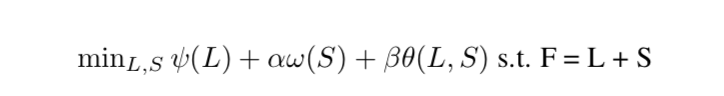

# Visual Saliency
    Exploiting Sparse and Low-rank Structured Matrix Decomposition(LSMD) for salient object detection

## Members
* Calvin Liang†
* Michael Mangione†
* Ravi K.Rajendran†§
* Quan Zhou†§

<small> † - Department of Computer Science, Boston University, Boston  
§ - Learning Intelligence and Signal Processing(LISP), Boston University, Boston </small>

## Problem to solve
The Low-rank matrix recovery problem is given by

where,  
    &nbsp;&nbsp;&nbsp; **&psi;(·)** is a low-rank constraint to allow identification of the intrinsic feature subspace of the redundant background patches,  
    &nbsp;&nbsp;&nbsp;  **&omega;(·)** is a structured sparsity regularization to capture the spatial and feature relations of patches in S,  
    &nbsp;&nbsp;&nbsp;  **&theta;(·,·)** is an interactive regularization term to enlarge the distance between the subspaces drawn from L and S,  
    &nbsp;&nbsp;&nbsp; **&alpha;**, **&beta;** are positive tradeoff parameters.

With this, we can take the feature matrix **F** of an input image and decompose it into a low-rank matrix part **L** (which represents the redundant information and non-salient background) plus a sparse matrix part **S** (which represents the salient objects in the foreground)

## Results
    Saliency Result of this model in a video

